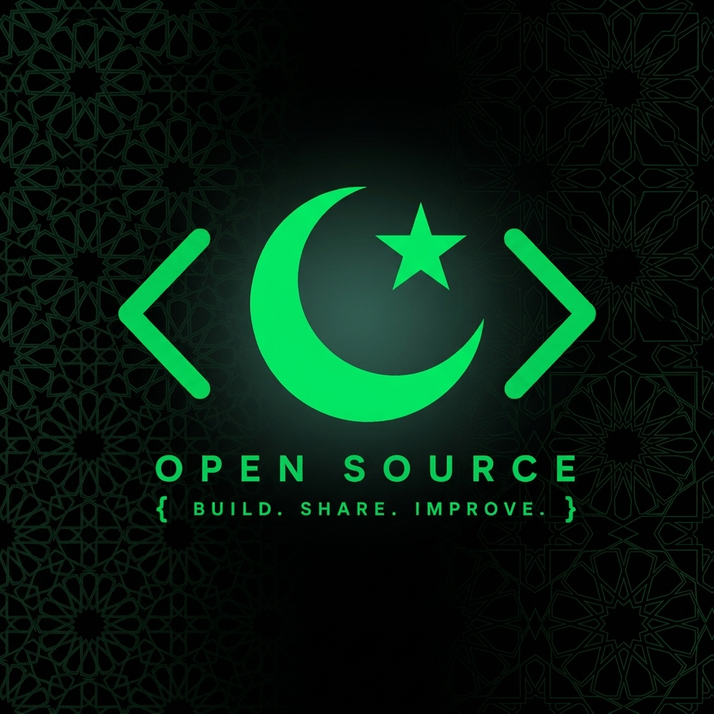

<div align="center">



<br/>

# بِسْمِ ٱللّٰهِ ٱلرَّحْمٰنِ ٱلرَّحِيمِ

### *In the Name of Allah, the Most Gracious, the Most Merciful*

<br/>

[](https://discord.gg/RCVW5Es6pQ)
[](https://github.com/Muslim-Devs-OSS)
[](https://github.com/Muslim-Devs-OSS)

---

**Muslim Devs Open Source** is the official open-source arm of the **Muslim Devs** community
a space for Muslim computer scientists and tech enthusiasts to **connect**, **collaborate**, and **grow**.

We build software that serves the Ummah and beyond.  
*All faiths are welcome if they respect our values.*

Through this **Open Source Organisation**, we invest in, build, and promote projects that align with our mission of serving the community through technology.

> *"Whoever guides someone to goodness will have a reward like one who did it."*  
> Prophet Muhammad ﷺ (Sahih Muslim)

</div>


<br/>

## 🚀 What We Do

We maintain two categories of projects under this organisation:

<table>
<tr>
<td width="50%" valign="top">

### 🏠 In-House Projects

Projects **conceived, designed, and built** by Muslim Devs members from the ground up.

- 🔨 Fully owned and maintained by the community
- 🎯 Driven by Ummah-focused needs and ideas
- 👥 Open for contributions from everyone
- 📋 Roadmaps shaped by community feedback

</td>
<td width="50%" valign="top">

### ⭐ Promoted / Featured Projects

Outstanding **external projects** that align with our mission, which we spotlight and support.

- 🌟 Curated for quality and community value
- 📣 Amplified through our network and reach
- 🤝 Collaborative support and contributions
- 🏅 Recognized for their impact on the Ummah

</td>
</tr>
</table>

<br/>

## 📂 Our Projects

### 🏠 In-House

| Project | Description | Status |
|---------|-------------|--------|
| *Coming Soon* | We're actively building stay tuned! | 🟡 In Development |

### ⭐ Featured

| Project | Description | Status |
|---------|-------------|--------|
| *Coming Soon* | Nominations open submit yours! | 🔵 Open for Nominations |

> 💡 **Have a project idea or want to nominate one?** Join our [Discord](https://discord.gg/RCVW5Es6pQ) and pitch it in the relevant channel!

<br/>

## 🤝 How to Contribute

We believe every contribution, big or small, counts. Here's how you can get involved:

```
1️⃣  Join our Discord community
2️⃣  Browse our repositories and find an issue labeled "good first issue"
3️⃣  Fork, code, and submit a Pull Request
4️⃣  Engage in discussions, code reviews, and idea sessions
```

Whether you're a **seasoned developer** or just **getting started**, there's a place for you here.

<details>
<summary><b>📜 Contribution Guidelines</b></summary>

<br/>

- **Be Respectful** - Our community is built on Islamic values of kindness and respect.
- **Write Clean Code** - Follow the project's coding standards and conventions.
- **Document Your Work** - Good documentation is just as important as good code.
- **Test Thoroughly** - Ensure your changes don't break existing functionality.
- **Communicate** - If you're working on something, let us know to avoid duplicate efforts.

</details>

<br/>

## 🌍 Our Values

<div align="center">

| | Value | Description |
|---|---|---|
| 🕋 | **Faith-Centered** | Our work is guided by Islamic principles of excellence (*Ihsan*) and benefit (*Maslaha*). |
| 🌐 | **Inclusive** | Open to all faiths and backgrounds, united by respect and shared purpose. |
| 🔓 | **Open Source** | We believe in the power of transparent, community-driven development. |
| 📈 | **Growth-Oriented** | We invest in our members' skills, careers, and spiritual development. |
| 🤲 | **Service-Driven** | Building technology that serves the Ummah and humanity at large. |

</div>

<br/>

## 💬 Join the Community

<div align="center">

**Ready to build something meaningful?**

[](https://discord.gg/RCVW5Es6pQ)

*Connect with 500+ Muslim developers worldwide.*  
*Segregated spaces · Project collaboration · Career growth · Islamic reminders*

</div>

<br/>

## 📊 Organisation Stats

<div align="center">


</div>

<br/>

---

<div align="center">

<sub>

**Muslim Devs Open Source** · Built with ❤️ and ☕ by the Muslim Devs Community

*"And cooperate in righteousness and piety, but do not cooperate in sin and aggression."* - Qur'an 5:2

</sub>

<br/>

<a href="https://discord.gg/RCVW5Es6pQ">Discord</a> · <a href="https://github.com/Muslim-Devs-OSS">GitHub</a>

</div>
